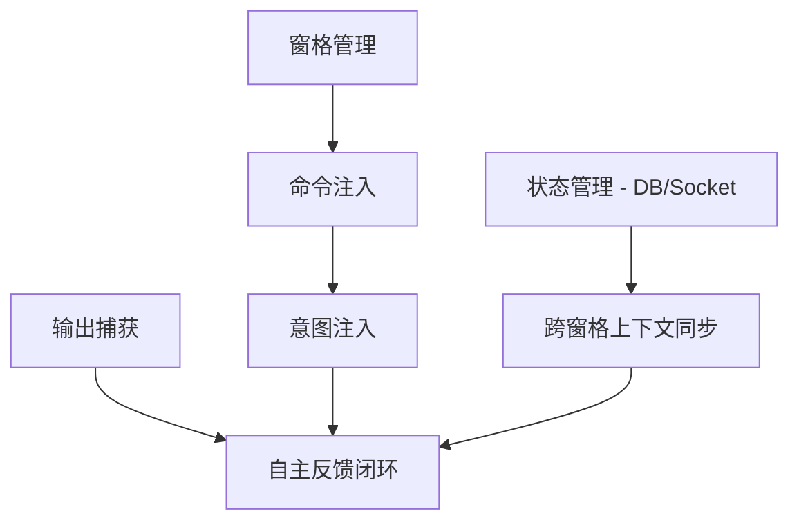

# 功能版图：AI 终端编排器 (vibe-cli)

**领域：** 基于终端的 AI 多智能体物理编排
**研究日期：** 2024-04-14
**整体置信度：** HIGH

## 基础功能 (Table Stakes)

这些是“终端虚拟操作员”工具必须具备的基础特性。缺失这些功能将导致产品体验碎片化或依赖手动干预。

| 功能 | 为什么是基础功能 | 复杂度 | 备注 |
|---------|--------------|------------|-------|
| **窗格生命周期管理** | 自动化管理工作区的物理布局（切分、调整大小、关闭）。 | 中 | 必须通过封装 Wezterm/Tmux CLI 实现。 |
| **命令注入 (Command Injection)** | 能够向特定窗格发送指令字符串，模拟人类输入 (`send-keys`)。 | 低 | 所有智能体动作的基石。 |
| **输出捕获 (Output Capture)** | 实时或定期监控 worker 窗格的 stdout/stderr。 | 中 | 智能体判断任务成败的关键反馈环。 |
| **人类确认网关 (HITL)** | 针对敏感操作（如 `rm`, `git push`）的安全审计环节。 | 低 | 建立用户对本地自动化信任的核心。 |
| **项目上下文自动发现** | 自动识别项目根目录、语言栈及相关文件结构。 | 低 | 确保智能体具备“环境感知”能力。 |
| **状态面板 (Status Dashboard)** | 提供直观方式查看哪些智能体正在运行及其当前状态。 | 低 | 避免终端成为不可见的“黑盒”。 |

## 差异化特性 (Differentiators)

这些功能使 `vibe-cli` 与简单的“终端聊天包装器”区分开来，体现其作为“调度层”的价值。

| 功能 | 价值主张 | 复杂度 | 备注 |
|---------|-------------------|------------|-------|
| **层级化意图注入 (Master-Worker)** | Master 智能体在不同窗格中调度、启动专门的 Worker 任务。 | 高 | 将“管理模式”应用于终端多窗格协作。 |
| **状态感知的物理调度** | 根据逻辑重心或资源需求，自动将关联窗格置于前台或聚焦。 | 高 | 例如：“自动弹出报错的测试窗格”。 |
| **跨窗格上下文同步** | 利用本地数据库 (SQLite) 或 Unix Socket 实现跨窗格的状态共享。 | 中 | 解决多智能体系统中的“分裂脑”问题。 |
| **自主反馈闭环 (Autonomous Loop)** | Master 自动审核 Worker 产出并在无人工干预下触发修正。 | 高 | 实现真正的“任务闭环”而非单纯的“指令执行”。 |
| **零配置环境传播** | 自动将 `PATH`、环境变量及 Secrets 同步到新开启的 Worker 窗格。 | 中 | 确保所有智能体执行环境的一致性。 |
| **进度摘要日志** | 将多窗格的原始日志提炼为高层级的“进度快报”。 | 中 | 大幅降低用户的认知负担。 |

## 非功能/反面特性 (Anti-Features)

为了保持专注和性能，我们明确**不**做的功能。

| 反面特性 | 为什么避免 | 替代方案 |
|--------------|-----------|-------------------|
| **自定义终端模拟器** | 开发维护成本极高，破坏用户既有习惯。 | 深度集成 Wezterm/Tmux CLI。 |
| **全局云端编排** | 增加延迟、复杂度和隐私风险，背离本地优先原则。 | 专注于“本地优先”的物理调度。 |
| **重度 Web/Electron GUI** | 偏离目标用户（终端开发者）的原生工作流。 | 使用 TUI (Terminal UI) 或保持纯命令行。 |
| **通用对话聊天** | 市面上已有大量工具（如 Aider, ChatGPT CLI）。 | 专注在*物理调度与任务闭环*。 |

## 功能依赖关系

## MVP 建议建议

为了验证“终端虚拟操作员”的核心价值，MVP 阶段应优先实现：

1.  **核心编排 (Wezterm/Tmux 包装器)**：支持基础的窗格切分与命令注入。
2.  **基础 Master-Worker 意图注入**：Master 智能体能在一个新窗格中触发指定任务。
3.  **基础监控**：捕获 Worker 的退出码及最后 10 行输出日志。
4.  **状态持久化**：使用简单 SQLite 数据库记录“任务 ID -> 窗格 ID -> 状态”。
5.  **安全网关**：增加 `--confirm` 标志，在执行任何智能体生成的命令前强制提示。

### 延迟到 V2 的功能：
- **复杂自主闭环**：初期可采用“单步验证”模式。
- **深度上下文缝合**：初期仅共享基础环境变量。
- **高级 TUI 仪表盘**：初期仅提供简单的 `vibe status` 命令输出。

## 参考来源

- [Wezterm CLI Documentation](https://wezfurlong.org/wezterm/cli/index.html) (HIGH)
- [Tmux Man Pages](https://man7.org/linux/man-pages/man1/tmux.1.html) (HIGH)
- [Multi-Agent System Design Patterns (AutoGen/CrewAI)](https://github.com/microsoft/autogen) (MEDIUM)
- [Claude Code 社区反馈](https://anthropic.com) (LOW)
